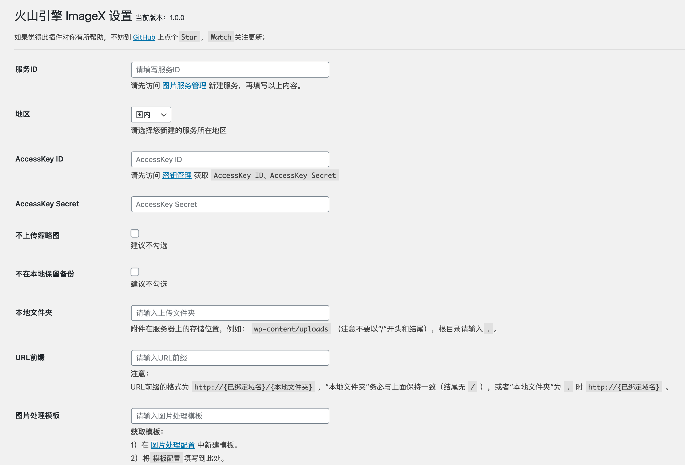

# ImageX

使用火山引擎图片服务（[ImageX](https://zjsms.com/RVvQxX8/)）作为附件存储空间的 WordPress 插件

> 推荐在开通`ImageX`时填写专属邀请码：`JTXSFT`

## 插件特色

* [x] 可配置是否上传缩略图和是否保留本地备份
* [x] 本地删除可同步删除火山引擎图片服务 ImageX 中的文件
* [x] 支持替换数据库中旧的资源链接地址
* [x] 支持完整地域使用
* [x] 支持同步历史附件到火山引擎图片服务 ImageX
* [x] 支持火山引擎图片服务 ImageX 图片处理
* [x] 支持后台媒体库列表缩略图显示 (请提交工单开通**源地址访问**功能)

## 安装

### 后台安装（推荐使用）

WordPress 后台安装插件页面搜索`ImageX`，点击安装

### 下载源码

从 GitHub 下载源码，通过 WordPress 后台上传安装，或者直接将源码上传到 WordPress 插件目录`wp-content/plugins`，然后在后台启用

GitHub 下载节点：[https://github.com/sy-records/volcengine-imagex-wordpress/releases/latest](https://github.com/sy-records/volcengine-imagex-wordpress/releases/latest)

## 修改配置

* 方法一：在 WordPress 插件管理页面有设置按钮，进行设置
* 方法二：在 WordPress 后台管理左侧导航栏`设置`下`火山引擎ImageX设置`，点击进入设置页面

## 插件截图

## 常见问题

1. 开启插件并上传图片，在后台媒体库和文章中不能正常访问，但在前台显示正常

请前往火山引擎官网，ImageX图片服务的服务管理中打开*源地址访问*功能。 
